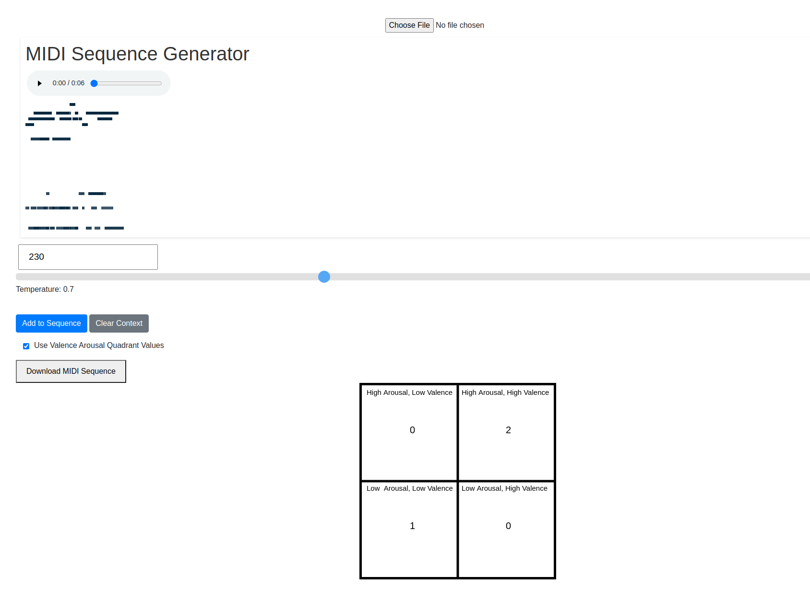

Flask app to generate music using 2 models: concatenated-transformer based on [continous-concatenated](https://github.com/serkansulun/midi-emotion) transformer model, using the 4 quadrant emotion system trained on the EMOPIA dataset and REMIPlus encoded MIID files, and a no conditioning decoder-only transformer trained on the lahk_midi clean dataset.  

Screenshot of app using Arousal/Valence Quadrant values to condition generation

