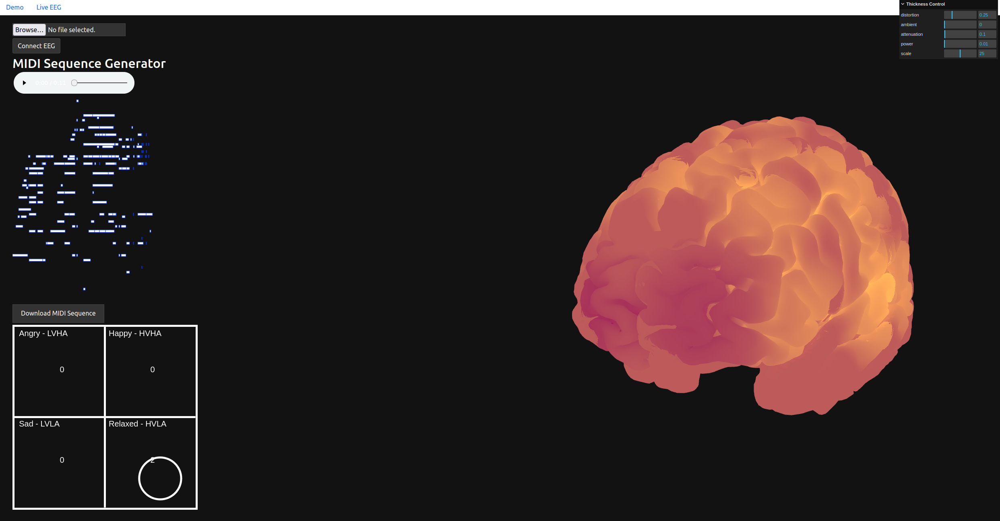

Flask app to generate music using 2 models: concatenated-transformer based on [continous-concatenated](https://github.com/serkansulun/midi-emotion) transformer model, using the 4 quadrant emotion system trained on the EMOPIA dataset and REMIPlus encoded MIID files, and a no conditioning decoder-only transformer trained o  n the lahk_midi clean dataset.  

A live 3D visualization coded using three.js allows the user to see live brain activity. 

The circle in the 4 quadrants changes position and size based on the inferred user's emotional state. The position indicates the user's valence and arousal values and the circle size on the dominance value (intensity).

Music is generated based on these values, using a model trained on the DEAP dataset using the Muse headset channels.

Image of app using Arousal/Valence Quadrant values to condition generation

